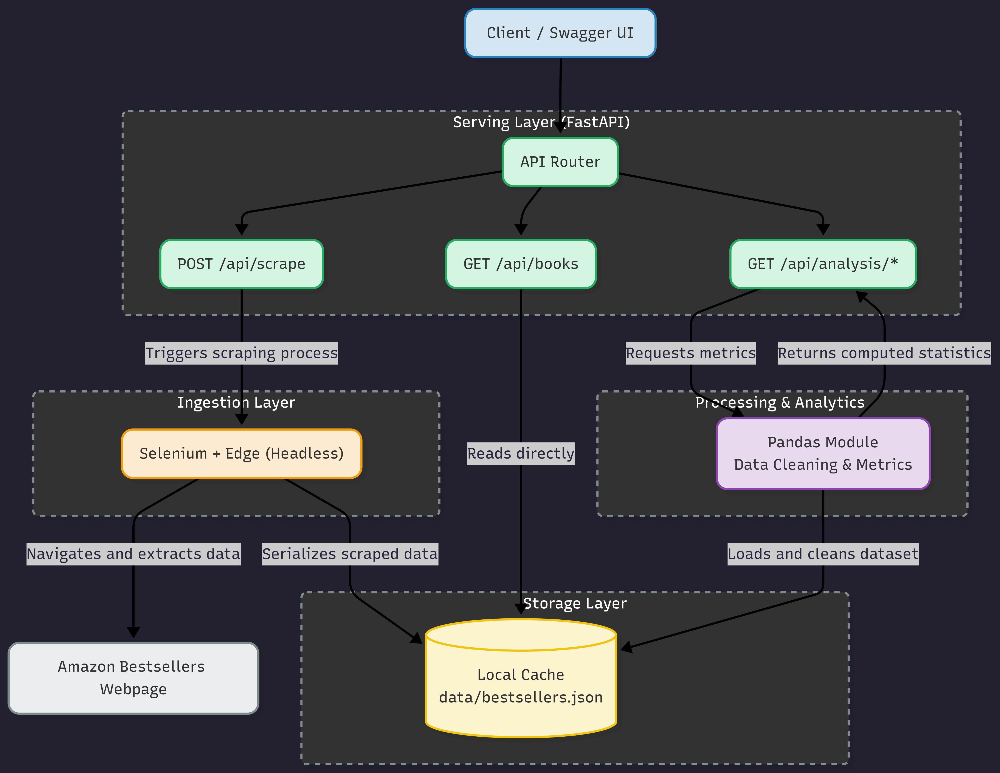

# Amazon Bestsellers: Data Pipeline and Analytics API
**Tech Challenge - Phase 1 | Machine Learning Engineering**

This project provides a containerized REST API built with FastAPI and Selenium. It automates the extraction of the Top 100 Amazon Bestselling books, persists the collected data in a local JSON cache, and offers specialized analytical endpoints for market research.

## Documentation
* [View the Full Documentation (PDF)](documentation/main_doc.pdf)

## Project Architecture



1. Ingestion: Selenium utilizing Headless Edge bypasses lazy-loading to scrape 100 book records.
2. Storage: Scraped data is serialized and cached locally in `data/bestsellers.json`. This acts as a Temporary Local Dataset, ensuring analytical queries are rapid and do not trigger redundant web requests.
3. Analytics: Dedicated routes utilize Pandas to process the cached JSON and compute statistical metrics.

---

## Project Structure
```text
Tech-Challenge-FIAP/
├── data/
│   └── bestsellers.json       # Local JSON cache for scraped data
├── documentation/
│   ├── main_doc.pdf           # Compiled project documentation
│   └── main_doc.tex           # LaTeX source for documentation
├── src/
│   ├── __init__.py
│   ├── analysis.py            # Data cleaning and Pandas analytics logic
│   ├── main.py                # FastAPI routes and application entry point
│   └── scraper.py             # Selenium scraping logic
├── .gitignore                 # Specifies files for Git to ignore
├── Dockerfile                 # Instructions for containerization
├── LICENSE                    # MIT License information
├── README.md                  # Project overview and guide
└── requirements.txt           # Python dependency list
```
---

## Execution Guide

### Option 1: Local Terminal (Virtual Environment)
Ideal for quick testing if you have Microsoft Edge installed on Windows.
1.  **Create & Activate VENV:**
    ```bash
    python -m venv .venv
    .\.venv\Scripts\activate
    ```
2.  **Install Dependencies:**
    ```bash
    pip install -r requirements.txt
    ```
3.  **Run Server:**
    ```bash
    uvicorn src.main:app --reload
    ```
4.  **Access:** `http://127.0.0.1:8000/docs`

### Option 2: Docker Container 
The most stable method. It bundles a Linux-compatible Edge browser internally.
1.  **Build Image:**
    ```bash
    docker build -t amazon-api .
    ```
2.  **Run Container:**
    ```bash
    docker run -p 8000:8000 amazon-api
    ```
3.  **Access:** `http://localhost:8000/docs`

### Option 3: Cloud Deployment (Railway/Render)
For remote testing without local installation:
**Live Docs:** `https://tech-challenge-fiap-hhae.onrender.com/docs`

---

## API Workflow & Testing
To properly test the application, follow this sequence in the Swagger UI:

1.  **Check Health:** Execute `GET /health` to confirm the API is up.
2.  **Trigger Scrape:** Execute `POST /api/scrape`. 
    * *What happens:* A browser opens (headless), scrolls, and saves 100 items to a local file.
3.  **Retrieve Data:** Execute `GET /api/books`. It reads directly from the generated file.
4.  **Run Analytics:** Use `/api/analysis/pricing`, `/api/analysis/authors`, etc. 
    * *Note:* These routes perform calculations on the **cached dataset** generated in step 2.

---

## Data Storage Notice
The API generates a `data/bestsellers.json` file inside the environment. If running in **Docker**, this file exists inside the container's isolated filesystem. To persist this to your host machine, use a volume:
`docker run -p 8000:8000 -v %cd%/data:/app/data amazon-api`